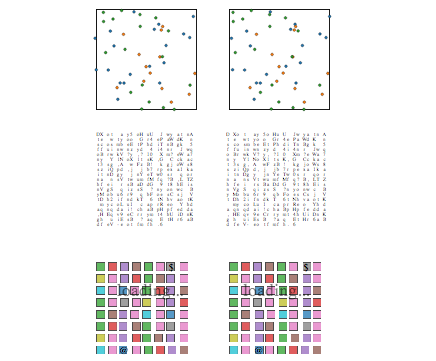

[See it live!](http://stated.github.io/html_3d/)
Experience it!

## Intro

Flat is boring, eveyone knows.

It's why Earth was made a ball (of course, not initially), and why Einstein invented curved spacetime.

But no more BS - [check it out!](http://stated.github.io/html_3d/) 

## Libraries

We use D3.js. It sounds close to 3D, so we should be fine, right?

## License 

The content (except for D3.js) is distributed on [WTFLP](http://www.wtfpl.net/), the only license serious enough for this project.